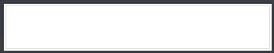

# git-commit-activity-display

---

`git clone https://github.com/devohno/git-commit-activity-display.git`

`cd git-commit-activity-display`

`vi .env`

then, put your github access token in `.env` file.

like

`REACT_APP_API_GITHUB="token <your_access_token>"`

then

`yarn && yarn start`
